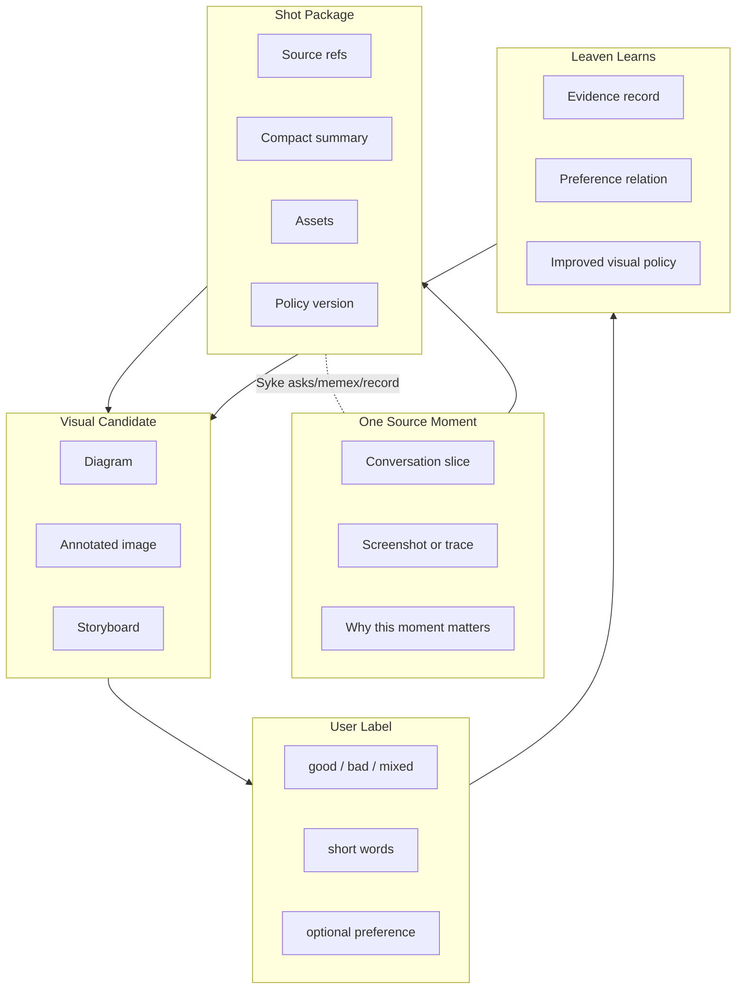
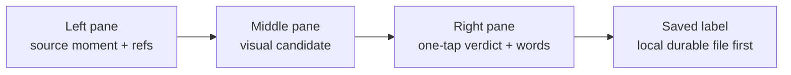

# Shot 0001 - Visual Communication Loop

Status: unlabeled candidate artifact. Created: 2026-06-14.

## What This Is

This is the first concrete visual-shot artifact for the Leaven visual
communication personalization loop. It is meant to be judged by the user as an
example of how Codex/Leaven should compress a dense conversation into a visual
explanation.

This artifact is not product law. It is a seed: one source moment, one visual
candidate, and one place to attach words like "good", "too abstract", "needs
more image", or "faithful but not useful".

## Source Moment

The source moment is the user's request on 2026-06-14:

> Figure out how to make pictures for my shots, compare it to a single moment
> of shots, put it into a diagram I can understand, and let me tune it with
> short words like "this is good". Combine that with Leaven so the system
> learns how to communicate visually to me.

Grounding refs:

- `docs/working-memory/visual-communication-personalization.md`
- local Syke checkout: `/Users/darin/vendor/github.com/saxenauts/syke`
- Annotation UI reference: `/Users/darin/src/personal/chat-unification/annotation_ui`

## Conversation Summary To Pair With The Label

The user wants an annotation loop for visual communication quality. The system
should produce a visual candidate for one bounded source moment, show it beside
that moment, and store the user's short natural-language reaction with enough
summary/provenance that Leaven can optimize future renderings.

Key constraints already known:

- The optimized object is the visual communication policy, not a generic image.
- Labels can be words, scalar verdicts, or pairwise preferences.
- Syke can supply continuity and prior context, but live MacBook Syke state is
  still unverified because SSH likely blocked on 1Password-backed auth.
- The existing Annotation UI is a reference interaction pattern, not the final
  visual-shot schema.

## Candidate Visual



## How To Judge This Candidate

Use short words. The point is to teach the system your visual taste without
turning you into a rubric clerk.

Good labels for this artifact:

- "good, keep this shape"
- "too abstract"
- "needs the actual picture"
- "too many boxes"
- "faithful but not useful"
- "make the left side the moment and the right side the learning loop"
- "this is the right compression"

## What The Annotation UI Should Show



The UI should not ask the user to classify internal Leaven concepts unless that
classification is itself the thing being tuned. The default input should be a
small verdict plus free words.

## Initial Label Slot

Unlabeled.

Suggested first response shape:

```text
verdict: good | bad | mixed | unsure
words: <whatever you would naturally say>
```

## Machine Seed

The companion machine-readable seed is
`docs/working-memory/visual-communication-artifacts/shot-0001-loop.json`.
