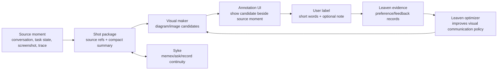

# Visual Communication Personalization

Status: current understanding, unimplemented. Created: 2026-06-14.

## Authority

This is a Leaven working-memory ledger. It is not product law, not a spec, and
not proof that any system works. Keep revising this single file as evidence and
annotations arrive. Promote only hardened contracts into `docs/specs`, code, or
the nearest owning `AGENTS.md`.

## User Intent

The user wants a feedback loop that teaches Leaven how to communicate visually
to him: generate pictures or diagrams for a "shot" of work, compare the visual
against the exact moment it is meant to explain, and let the user tune it with
short natural-language reactions like "this is good".

Each labeled visual should be paired with enough conversation summary and
source context that the label remains useful later. The aim is not generic
image generation. The aim is a personalized visual communication policy: how to
render dense agent/work/conversation state so the user understands it quickly
and can steer the system image by image.

## Current Vocabulary

- `shot`: a bounded moment to communicate visually. This may be a screenshot,
  a conversation turn, an agent state, a code-review finding, a plan step, or a
  before/after slice. It must carry source references, not just prose.
- `single moment`: the source truth for one visual. The generated picture or
  diagram is judged against this moment.
- `visual candidate`: the concrete rendering shown to the user. It may be a
  diagram, annotated screenshot, storyboard panel, chart, or generated bitmap.
- `conversation summary`: the compact textual context stored with the visual
  candidate so the future optimizer can understand why the label was given.
- `label`: user feedback such as "good", "confusing", "too abstract", "needs
  more spatial grouping", "faithful but ugly", or pairwise preference between
  two visual candidates.
- `visual communication policy`: the artifact Leaven should optimize. It could
  be a prompt, renderer recipe, diagram schema, style guide, or examples bank.

## System Shape



The important loop is:

1. Capture one source moment as a shot package.
2. Generate one or more visual candidates from that package.
3. Show the candidate next to the source moment in an annotation surface.
4. Record the user's words and enough summary/provenance to make the label
   durable.
5. Feed those labels to Leaven as evidence or preferences.
6. Optimize the artifact that controls future visual communication.

## Leaven Fit

This idea fits existing Leaven design pressure instead of needing a special
engine:

- Artifact-shape neutrality: the optimized artifact can be a prompt, renderer
  config, diagram grammar, examples bank, or structured visual policy.
- Rendering separated from artifact: the shot stays as source truth; diagrams,
  images, and summaries are renderings for a particular consumer.
- Evidence-shape neutrality: the user feedback can be scalar, text feedback,
  pairwise preference, listwise ranking, or mixed evidence.
- User-owned semantics: Leaven should not infer what "visually good for Darin"
  means. The annotation labels define it.
- Run graph/audit value: every visual candidate should be traceable to the
  shot package, the generation policy version, and the user label.

Likely Leaven homes if this hardens:

- `leaven-evidence`: typed feedback / preference records if existing evidence
  vocabulary is insufficient.
- `leaven-surface` or a future behavior-bearing visual artifact crate only if
  we need explicit editable visual surfaces.
- `leaven-run` / Python SDK examples for the first user-facing optimization
  path.
- `docs/specs` only after the data contract is known.

Do not put this into a placeholder crate. If a crate appears, it needs real
behavior, tests, topology rows, and local ownership docs.

## Syke / Psyche Understanding

Observed locally:

- `psyche` is not a PATH command on this Mac.
- The relevant local checkout appears to be Syke at
  `/Users/darin/vendor/github.com/saxenauts/syke`.
- Syke's agent identity block is named `<psyche>`.
- The user-facing query path is `syke ask`; fast projection is `syke memex`;
  explicit writeback is `syke record`.
- Syke's documented local state includes `~/.syke/MEMEX.md`,
  `~/.syke/PSYCHE.md`, `~/.syke/syke.db`, and adapter guides.

MacBook probe:

- Tailscale shows `darins-macbook-pro` active.
- `ssh MacBook` resolves to hostname `macbook` but DNS did not resolve.
- `ssh darins-macbook-pro ...` hung during a noninteractive probe, likely at
  SSH auth/key-provider. The user suggested this might be 1Password. Treat the
  MacBook/Syke runtime state as unverified until auth is cleared.

Role in this project:

- Syke should supply continuity: "what was this moment?", "what was the user
  trying to understand?", and "what feedback patterns already exist?"
- Syke should not be treated as product truth by itself. Its memex is a
  projection; `syke ask` can search deeper timeline evidence when available.
- Useful future question: "For visual communication personalization, what
  prior conversations and examples should be paired with each label?"

## Annotation UI Understanding

Existing reference:

- `/Users/darin/src/personal/chat-unification/annotation_ui` is a local
  labeling app over conversation units.
- Its current data model labels one text unit with per-criterion verdicts:
  `pass | fail | either`, plus a note.
- Its persistence spec says labels should be durable through localStorage,
  local `labels.json`, and Braintrust writes, with visible save status.
- It already has the right ergonomic pattern for fast labeling and short notes,
  but its domain schema is taste-gold text criteria, not visual communication.

For this project, "Annotation UI" probably means reuse the pattern, not reuse
the exact `taste-gold` schema. The new record shape needs image/diagram assets,
source moment refs, conversation summary, candidate policy version, and labels
that can express preference and free-form taste feedback.

## Candidate Label Record Sketch

This is intentionally a sketch, not a spec:

```jsonc
{
  "id": "visual-shot/<source>/<stable-moment-id>/<candidate-id>",
  "shot": {
    "source_refs": ["syke:...", "codex-session:...", "file:..."],
    "summary": "Compact context for why this moment matters.",
    "moment_text": "Optional source excerpt or redacted trace projection.",
    "assets": [
      { "kind": "screenshot", "path": "...", "media_type": "image/png" }
    ]
  },
  "candidate": {
    "policy_id": "visual-policy/<hash>",
    "kind": "diagram|bitmap|annotated_screenshot|storyboard",
    "asset_path": "...",
    "prompt_or_recipe_ref": "..."
  },
  "label": {
    "verdict": "good|bad|mixed|unsure",
    "words": "this is good",
    "preference": { "beats": ["candidate-b"], "loses_to": [] },
    "updated_at": "2026-06-14T23:48:21Z"
  }
}
```

## Artifact Index

- `visual-communication-artifacts/shot-0001-loop.md`: first human-readable
  visual-shot artifact for labeling the bootstrap loop.
- `visual-communication-artifacts/shot-0001-loop.json`: machine-readable seed
  for the same artifact.

## Open Decisions

- What exactly counts as a "shot" for the first dataset: screenshot, chat turn,
  task state, or a bundled unit containing all three?
- Should the first visual candidate be generated bitmap, deterministic diagram,
  or both side by side?
- Does the user want labels pushed to Braintrust, Syke, Leaven run stores, or a
  local JSONL first? Current bias: local durable file first, then promote.
- Which artifact should Leaven optimize first: a prompt, a diagram schema, or a
  small examples bank?
- Is the comparison primarily candidate-vs-source faithfulness, candidate-vs-
  candidate preference, or "does this communicate hard enough to Darin"?

## Next Actions

1. Clear or bypass the MacBook SSH/1Password auth block, then run:
   `syke status`, `syke memex`, and a targeted `syke ask` about prior visual
   communication/preferences.
2. Define the smallest visual-shot dataset shape outside product specs.
3. Create a tiny annotation fixture with one source moment and one visual
   candidate.
4. Decide whether to adapt `chat-unification/annotation_ui` or make a new
   Leaven-local example surface.
5. Only after the first labels exist, design the Leaven optimizer path around
   the actual evidence shape.

## Revision Log

- 2026-06-14: Initial capture from user request, local Leaven docs, local Syke
  checkout, and chat-unification annotation UI docs. MacBook Syke state remains
  unverified because SSH hung, likely on 1Password-backed auth.
